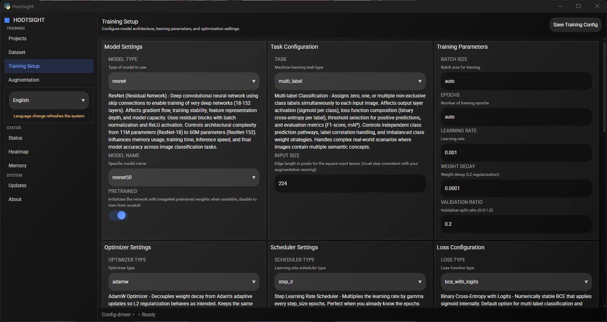

# Start Here

Welcome to Hootsight's in-app documentation. This hub works entirely offline so you always have access, and the files live under `docs/` to stay in sync with GitHub clones or forks.

## Quick links

- [About these docs](about.md)
- [Projects guide](guides/projects.md)
- [Configuration guide](guides/configuration.md)
- [Training guide](guides/training.md)
- [Augmentation guide](guides/augmentation.md)
- [Model architecture guide](guides/models.md)

## Why this page loads first

The UI prefers `start.md` so new users always land on a concise orientation. Keep this file short, link out to deeper guides, and remember the viewer caches content locally for fast navigation.

## Working locally and on GitHub

- All links are relative so they resolve inside the app and on GitHub.
- Any image or downloadable asset must live under the `docs/` tree; reference it with a relative path like `imgs/app.png`.
- When you pull from GitHub, refreshed markdown appears instantly without rebuilding the UI.

## Suggested next steps

1. Scan the [About page](about.md) for a full index of the available guides.
2. Follow the [training guide](guides/training.md#before-you-begin) to verify your dataset layout matches what Hootsight expects.
3. Review the [configuration guide](guides/configuration.md) before committing large JSON tweaks.

Need something that is missing? Drop a well-structured issue in the upstream repo so we can fold it into this library for everyone.

_Page created by Roxxy (AI) – 2025-10-01._